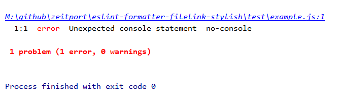

# eslint-formatter-filelink-stylish

This ESLint formatter is a modifications of the stylish formatter to support autolinkable filepaths.




## Getting started

Install formatter

```cli
npm install eslint-formatter-filelink-stylish --save-dev
```

Use it with eslint CLI

```cli
eslint -f filelink-stylish .
```

or via nodejs 

```JavaScript
'use strict';

const CLIEngine = require('eslint').CLIEngine;
const formatter = require('../index');

const cli = new CLIEngine({
    useEslintrc: true,
    cwd:__dirname
});
const report = cli.executeOnFiles(['example.js']);

console.log(formatter(report.results));
``` 

  
